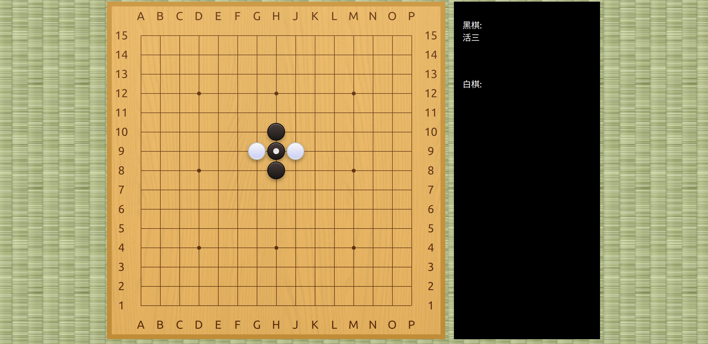

# GoBang AlphaZero

A high-performance AlphaZero implementation for GoBang (Gomoku/Five-in-a-Row) with distributed self-play training, featuring novel algorithmic optimizations for efficient GPU utilization.



## Key Innovations

| Innovation | Description |
|------------|-------------|
| **Generator-Based MCTS** | Uses Python `yield from` coroutines to decouple tree search from neural network inference, enabling efficient batching of 128+ concurrent game states without explicit queues or threading |
| **Adaptive Dirichlet Noise** | Exploration noise scales inversely with board occupancy: `α = (w²/valid_positions) × base_α`. More exploration early game, exploitation late game—automatically |
| **Stone-Count Indexing** | MCTS statistics indexed by `(state_hash, move_count)` tuple, enabling efficient partial tree resets and phase-aware statistics |
| **Dihedral Symmetry in Search** | Random D4 group transformation (8-fold) applied at inference time with inverse mapping on policy output—implicit data augmentation without storage overhead |
| **Smooth Temperature Decay** | Exponential τ decay (`τ *= 0.9` per move) instead of hard threshold switch, for gradual exploration→exploitation transition |

## Architecture

### System Overview

```
┌─────────────────────────────────────────────────────────────────────┐
│                         Training Pipeline                           │
├─────────────────────────────────────────────────────────────────────┤
│                                                                     │
│   ┌──────────────┐         ┌──────────────┐         ┌────────────┐ │
│   │  Self-Play   │ ──────▶ │   Replay     │ ──────▶ │  Training  │ │
│   │   Workers    │ samples │   Buffer     │  batch  │   Server   │ │
│   │    (32×)     │         │   (10K)      │         │   (GPU)    │ │
│   └──────┬───────┘         └──────────────┘         └─────┬──────┘ │
│          │ yield state                                    │        │
│          ▼                                                │        │
│   ┌──────────────┐                                        │        │
│   │  Inference   │ ◀──────────────────────────────────────┘        │
│   │   Servers    │         broadcast weights                       │
│   │    (5×)      │                                                 │
│   └──────────────┘                                                 │
│                                                                     │
└─────────────────────────────────────────────────────────────────────┘

┌─────────────────────────────────────────────────────────────────────┐
│                         Inference Pipeline                          │
├─────────────────────────────────────────────────────────────────────┤
│                                                                     │
│   Frontend (Preact)  ──HTTP──▶  Flask Backend  ──callback──▶  AI   │
│                                                                     │
│   Deployment options:                                               │
│   • PyTorch (FP32/FP16)                                            │
│   • ONNX Runtime                                                    │
│   • TensorRT INT8 (4× speedup)                                     │
│                                                                     │
└─────────────────────────────────────────────────────────────────────┘
```

### Neural Network

**ResNet-10 Policy-Value Network** (`model6.py`)

```
Input: (batch, 5, 15, 15)
       ├── Channel 0: Black stones
       ├── Channel 1: White stones
       ├── Channel 2: Previous black move
       ├── Channel 3: Previous white move
       └── Channel 4: Current player indicator

    ┌─────────────────────────────┐
    │  Conv2d(5→128, 3×3, pad=1) │
    │  BatchNorm2d → ReLU        │
    └─────────────┬───────────────┘
                  │
    ┌─────────────▼───────────────┐
    │                             │
    │   10 × Residual Block       │──┐
    │   ┌───────────────────┐     │  │
    │   │ Conv2d(128, 3×3)  │     │  │ skip
    │   │ BN → ReLU         │     │  │ connection
    │   │ Conv2d(128, 3×3)  │     │  │
    │   │ BN                │     │  │
    │   └─────────┬─────────┘     │  │
    │             │    ┌──────────┘  │
    │             └────┴─── + → ReLU │
    │                             │
    └─────────────┬───────────────┘
                  │
        ┌─────────┴─────────┐
        ▼                   ▼
┌───────────────┐   ┌───────────────┐
│  Policy Head  │   │  Value Head   │
├───────────────┤   ├───────────────┤
│ Conv1×1(128→32)│   │ Conv1×1(128→32)│
│ Flatten        │   │ Flatten        │
│ Linear→225    │   │ Linear→256    │
│ Softmax       │   │ ReLU→Linear→1 │
└───────┬───────┘   │ Tanh          │
        │           └───────┬───────┘
        ▼                   ▼
   π(a|s) ∈ ℝ²²⁵       v(s) ∈ [-1,1]
```

### MCTS Algorithm

**Upper Confidence Bound for Trees (UCT)**

```
a* = argmax [ Q(s,a) + c_puct · P(s,a) · √N(s) / (1 + N(s,a)) ]
         a

where:
  Q(s,a) = W(s,a) / N(s,a)     # Mean action value
  P(s,a) = π_θ(a|s)            # Neural network policy prior
  N(s,a) = visit count         # Stored in float16 for memory efficiency
  c_puct ∈ [0.001, 5.0]        # Exploration constant
```

**Dirichlet Noise Injection (Root Node)**

```
P'(s,a) = (1 - ε) · P(s,a) + ε · η_a

where:
  η ~ Dir(α · 1_k)
  α = (15²/valid_positions) × 0.3    # Adaptive scaling
  ε = 0.2                             # Noise weight
```

**Generator-Based Search Pattern**

```python
def search(self, state, stones, level=0):
    if not visited(state):
        p, v = yield state          # Suspend, batch externally
        store_statistics(state, p)
        return -v * discount

    action = select_ucb(state)
    next_state = apply(state, action)
    v = yield from self.search(next_state, stones+1, level+1)

    update_statistics(state, action, v)
    return -v * discount
```

## Training Configuration

| Parameter | Value | Description |
|-----------|-------|-------------|
| MCTS playouts | 100K (train) / 10K (eval) | Search iterations per move |
| c_puct | 0.001 - 5.0 | Exploration constant |
| Dirichlet α | 0.3 (base) | Noise concentration, adaptive |
| Dirichlet ε | 0.2 | Noise mixing weight |
| Temperature τ | 0.8 → 0.05 | Exponential decay, ×0.9/move |
| Batch size | 1024 | Training batch |
| Learning rate | 1e-4 | AdamW optimizer |
| Replay buffer | 10K samples | FIFO queue |
| Train frequency | Every 200 episodes | With 50 gradient steps |
| Data augmentation | 8-fold | D4 dihedral group |
| Value discount | 0.8 - 1.0 | Backpropagation discount |

## Project Structure

```
gobang/
├── 1_heuristic/          # Pattern-based baseline AI
│   ├── board.py          # O(4) incremental pattern tracking
│   ├── evaluate.py       # Threat pattern enumeration
│   └── play.py           # Flask integration
│
├── 2_alphazero/          # Neural MCTS implementation
│   ├── game*.py          # State encoding (3/4/5-channel variants)
│   ├── mcts*.py          # MCTS evolution (13 versions)
│   ├── model*.py         # Network architecture (9 versions)
│   ├── sim*.py           # Distributed training (Ray)
│   ├── infer_srv.py      # Batched GPU inference
│   ├── onnx_trtinfer_server_int8.py  # TensorRT deployment
│   └── models*/          # Checkpoints
│
├── 3_muzero/             # Model-based RL (WIP)
│
├── back_end/             # REST API server
│   └── __init__.py       # Callback-based routing
│
└── front_end/            # Web UI
    ├── src/index.js      # Preact + @sabaki/shudan
    └── webpack.config.js
```

## Quick Start

### Requirements

```bash
pip install torch ray flask numpy numba
cd front_end && npm install
```

### Training (Distributed)

```bash
# Start Ray cluster head
ray start --head --port=6379

# Launch training
cd 2_alphazero
python sim8.py
```

### Play Against AI

```bash
# Build frontend
cd front_end && npm run build

# Start with AlphaZero
cd 2_alphazero && python play4.py

# Or start with heuristic baseline
cd 1_heuristic && python play.py

# Open http://localhost:8080
```

### Export for Deployment

```bash
cd 2_alphazero
python exportonnx.py                    # PyTorch → ONNX
python onnx_trtinfer_server_int8.py     # ONNX → TensorRT INT8
```

## Implementation Highlights

### Generator-Based Batching

Unlike callback or queue-based approaches, we use Python generators for clean async batching:

```python
# Self-play loop batches inference across 128 parallel games
generators = [mcts.search(state) for state in games]
while active:
    states = [next(g) for g in generators]        # Collect states
    policies, values = network.batch_infer(states) # Single GPU call
    for g, p, v in zip(generators, policies, values):
        g.send((p, v))                            # Resume search
```

### Dihedral Symmetry Exploitation

8-fold board symmetry (D4 group) used at both training and inference:

```python
# Inference: random transformation → network → inverse transform
transform = random_dihedral()           # {rot90^k, flip} for k∈{0,1,2,3}
policy, value = network(transform(state))
policy = inverse_transform(policy)      # Map back to original coordinates
```

### Adaptive Exploration

Dirichlet noise concentration adapts to game phase:

```python
valid_count = count_empty_positions(state)
alpha = (BOARD_SIZE ** 2 / valid_count) * BASE_ALPHA
# Early game (valid_count ≈ 225): low alpha → diverse noise
# Late game (valid_count ≈ 20):  high alpha → concentrated noise
```

## References

- Silver, D., et al. (2017). [Mastering the game of Go without human knowledge](https://www.nature.com/articles/nature24270). *Nature*.
- Silver, D., et al. (2018). [A general reinforcement learning algorithm that masters chess, shogi, and Go through self-play](https://www.science.org/doi/10.1126/science.aar6404). *Science*.

## License

MIT
